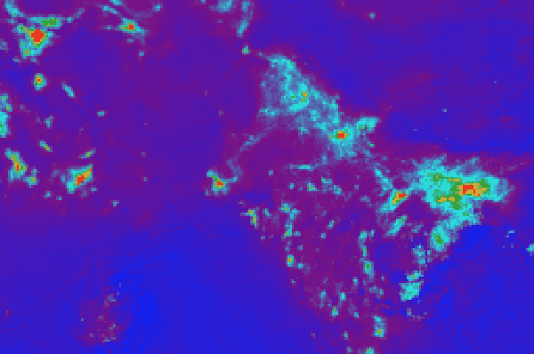
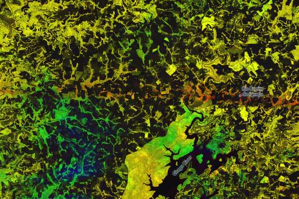
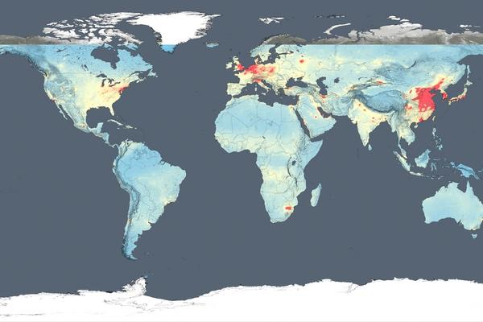
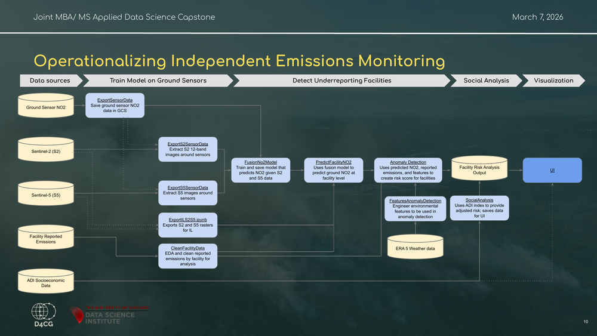
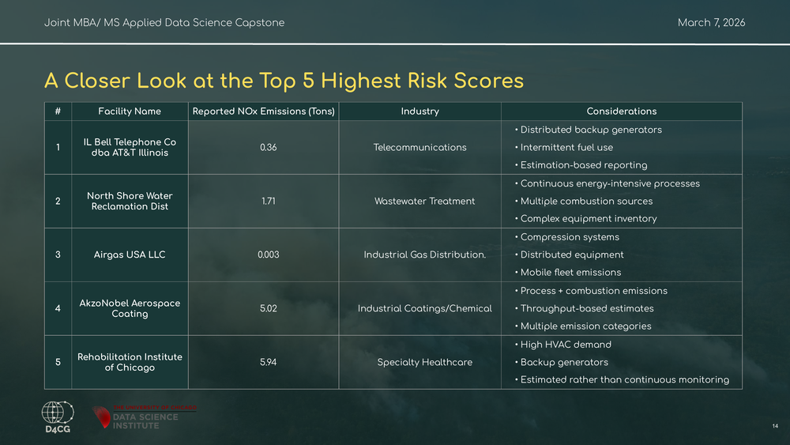

# Multimodal Industrial Emissions Verification & Environmental Justice

<!-- Status badges -->

[](https://github.com/brngo13/MSADS_Team1/stargazers)
[](https://github.com/brngo13/MSADS_Team1/network)
[](https://github.com/brngo13/MSADS_Team1/issues)

<!-- Call‑to‑action badges -->

[](public/)
[](notebooks/)

> *Independent verification for cleaner air and fairer communities.*

## Project Motivation

Industrial facilities in the United States self‑report their emissions.  While mandatory reporting promotes transparency, it can miss under‑reporting, and oversight resources are limited.  At the same time, satellites now offer continuous observations of atmospheric NO₂.  Our capstone project leverages these new data streams to independently estimate facility‑level emissions and examine who is most at risk when reporting fails.

## Objectives & Features

- **Independent Verification:** Use a multimodal model to predict ground‑level NO₂ from satellite imagery, ground sensors and facility characteristics, providing an independent benchmark for reported emissions.
- **Anomaly Detection:** Identify facilities with potential under‑reporting using residual anomalies (difference between predicted and reported emissions), peer comparisons and atmospheric anomalies.
- **Environmental Justice:** Combine facility risk scores with census tract deprivation data (Area Deprivation Index) to see whether disadvantaged communities face higher under‑reporting risk.
 - **Interactive Insights:** Deliver a dashboard and notebooks that regulators and community members can use to explore facility risks, compare industries and examine equity patterns.

## Conceptual overview

Our project sits at the intersection of three pillars: independent emissions verification, multi‑modal data fusion and environmental justice.  Independent verification provides a neutral benchmark for facility emissions, data fusion combines satellite imagery with ground measurements and facility metadata, and environmental justice focuses our analysis on who bears the burden.  By bringing these pillars together, we uncover hidden pollution and identify communities most at risk.

## Data Sources

Sentinel‑5P is the first Copernicus mission dedicated to monitoring our atmosphere; the satellite carries the TROPOspheric Monitoring Instrument (TROPOMI) to map trace gases such as nitrogen dioxide.  The mission was launched on 13 October 2017 and provides daily global observations of atmospheric pollutants.  Sentinel‑2 is a polar‑orbiting, multispectral imaging mission for land monitoring.  Its twin satellites (Sentinel‑2A and 2B), launched in 2015 and 2017, supply 10–20 m resolution imagery of vegetation, soil, water and built environments.  We use these satellites alongside ground sensors and socioeconomic data to capture a rich picture of facility context.

| Source | Description | Access |
|-------|-----------|-------|
| **NEI Facility Data** | Annual NO₂ emissions self‑reported to the U.S. EPA’s National Emissions Inventory (NEI).  This dataset serves as our baseline for comparison. | [EPA NEI](https://www.epa.gov/air-emissions-inventories/national-emissions-inventory-nei) |
| **Microsoft Project Eclipse Sensors** | Low‑cost ground‑level NO₂ measurements deployed across Chicago; these hyper‑local observations are used as training labels for our multimodal model. | [Project Eclipse Dataset](https://planetarycomputer.microsoft.com/dataset/eclipse) |
| **Sentinel‑5P TROPOMI** | Daily satellite observations of tropospheric NO₂ columns captured by the TROPOMI instrument on ESA’s Sentinel‑5P mission.  These data provide atmospheric context for our model. | [Sentinel‑5P Data](https://sentinels.copernicus.eu/copernicus/sentinel-5p) |
| **Sentinel‑2 Imagery** | Multispectral images from ESA’s Sentinel‑2 constellation, offering high‑resolution (10–20 m) land‑cover context around each facility. | [Sentinel‑2 Data](https://sentinels.copernicus.eu/copernicus/sentinel-2) |
| **Area Deprivation Index (ADI)** | Socioeconomic index ranking neighborhoods by income, education, employment and housing quality, hosted by the University of Wisconsin’s Neighborhood Atlas. | [Neighborhood Atlas](https://www.neighborhoodatlas.medicine.wisc.edu/) |
| **Auxiliary Data** | Facility attributes (NAICS codes), census demographics and weather variables integrated from various sources. | — |

### Example data products

Below are sample visualizations from our key datasets.  These images help contextualize how the model sees the world—from atmospheric NO₂ columns to high‑resolution land‑cover and global pollution patterns.



*Example: Tropospheric NO₂ columns (moles/m²) from the Sentinel‑5P TROPOMI Level‑3 near real‑time product.*



*Example: Sentinel‑2 multispectral image showing land‑surface features near the Rio Bonito tornado scar.*



*Global map of tropospheric NO₂ concentrations, averaged for 2014.*

---

## Methodology

Our analysis follows a five‑stage pipeline:

1. **Ingestion & Alignment:** Align NEI, Sentinel‑5P, Sentinel‑2, ground sensors and socioeconomic data onto a common spatial grid and time frame.
2. **Fusion Model Training:** Train a late‑fusion neural network that combines Sentinel‑2 features, Sentinel‑5P columns and facility attributes to predict ground‑level NO₂.  The model explains about 60 % of the variation in observed concentrations.
3. **Facility Estimation:** Apply the trained model to satellite snapshots around each facility to generate independent NO₂ estimates.
4. **Risk Scoring:** Compute residual, peer and atmospheric anomalies and combine them into a hybrid risk score (60 % residual, 20 % peer, 20 % atmospheric) to flag potential under‑reporters.
5. **Socioeconomic Overlay:** Merge risk scores with ADI scores to identify whether high‑risk facilities are located in disadvantaged communities.

An overview of the data pipeline is shown below:



---
## Dashboard & Notebook Highlights

Our tools aren’t just data dumps. They’re interactive experiences designed for exploration:

- **Interactive Map:** View facility risk scores on a map of the U.S., zoom in on communities, and filter by industry, fuel type or risk percentile.
- **Anomaly Components:** Drill down into the residual, peer and atmospheric anomaly components to see which mechanism drives a facility’s risk.
- **Equity Overlay:** Toggle the Area Deprivation Index overlay to visualise socioeconomic vulnerability alongside facility risk.
- **Comparative Charts:** Compare risk distributions across industries, states or emission quartiles with dynamic bar and box plots.
- **Notebook Workflows:** Reproduce our entire analysis from data ingestion to model training and risk scoring in our Jupyter notebooks.

## Model & Technical Details

Our late‑fusion model integrates multiple data streams and feature types:

- **Sentinel‑2 Features:** We extract convolutional features from the multispectral Sentinel‑2 images (bands B04, B03, B02 and B08) around each facility at 10 m resolution.
- **Sentinel‑5P Columns:** Daily tropospheric NO₂ columns are aggregated into temporal features that capture atmospheric patterns and seasonal cycles.
- **Facility Attributes:** Facility‑level metadata such as NAICS codes, permit types and reported emissions are embedded as one‑hot or continuous features.
- **Late Fusion Architecture:** Separate branches process imagery, column data and attributes before concatenation and final prediction.  The model is trained with mean‑squared‑error loss to predict ground‑level NO₂, achieving an R² of about 0.60 on held‑out sensors.
- **Training Details:** We use hundreds of sensors and thousands of satellite snapshots for training, applying 5‑fold cross‑validation and early stopping to prevent overfitting.  The model is implemented in PyTorch and available in our notebooks.

## Results & Impact

Our approach highlights facilities where reported emissions diverge from satellite‑based expectations and underscores broader patterns:

- **Mid‑scale Emitters:** Under‑reporting risk peaks among mid‑scale emitters; smaller and larger facilities generally have lower risk.
- **Facility Rankings:** Top‑risk facilities include major telecommunication, utility and chemical plants; many rely on distributed generators or estimation‑based reporting.
- **Environmental Justice:** High‑risk facilities are concentrated in socially disadvantaged tracts, indicating that communities with high ADI scores are exposed to greater under‑reporting risks.
- **Regulatory Action:** While satellite models cannot confirm non‑compliance, they help regulators prioritise inspections and allocate monitoring resources more efficiently.
- **Broader Applicability:** The methods can be extended to other pollutants and jurisdictions, providing a scalable framework for independent emissions verification.



## Future Work

We see many opportunities for improvement and extension:

- **Additional Pollutants:** Apply our fusion framework to sulfur dioxide, particulate matter and methane to broaden coverage.
- **Higher Resolution:** Incorporate 3 m PlanetScope imagery or geostationary satellites to capture finer spatial and temporal patterns.
- **More Sensors:** Deploy more ground monitors or integrate low‑cost sensor networks beyond Chicago to validate and refine models nationally.
- **Equity Indices:** Combine the ADI with other socioeconomic indices (e.g., Social Vulnerability Index, Environmental Justice Index) to capture multiple dimensions of vulnerability.
- **User Experience:** Enhance the dashboard with time series visualisations, facility search, bookmarking and export functions.

## Contributing

We welcome contributions!  If you find an issue or have an idea for an improvement, please open an [issue](https://github.com/brngo13/MSADS_Team1/issues) or submit a pull request.  See our notebooks and scripts for context, and feel free to reach out to the team via GitHub for questions.

## Getting Started

To reproduce our analysis or build upon it:

1. **Clone the repository:**
   ```bash
   git clone https://github.com/brngo13/MSADS_Team1.git
   ```
2. **Install dependencies:** Use `conda` or `npm` as specified in `package.json` and our notebooks.
3. **Explore notebooks:** The `notebooks/` directory contains notebooks for data preprocessing, model training, anomaly detection and socioeconomic analysis.  These notebooks follow the workflow described above.
4. **Run scripts:** Use scripts in `scripts/` to export Sentinel‑2 and Sentinel‑5P data, train the fusion model and compute risk scores.
5. **Launch the dashboard:** The `public/` directory hosts an interactive dashboard.  From the repository root, run the web server and navigate to the dashboard to explore facility risk scores and ADI overlays.

## Team & Acknowledgements

This project was developed by **Lauren Adolphe**, **Aneesha Dasari**, **Rinad Salkham** and **Brianna Ngo**, with guidance from **Nick Kadochnikov**.  We thank the Data Science Capstone instructors and collaborators who provided data and feedback.  Sentinel‑2 and Sentinel‑5P data are provided by the European Space Agency; ADI data by the University of Wisconsin; NEI data by the U.S. EPA.
